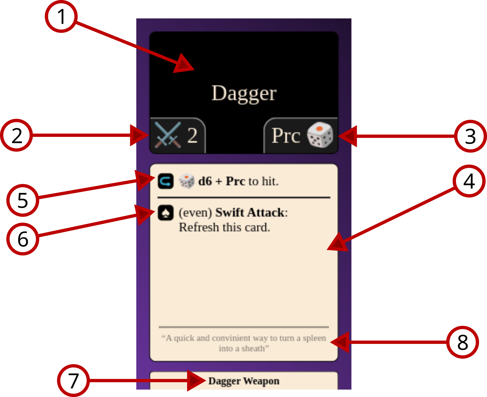

# Weapons

## Example

1. The top box which contains the name of the weapon as well as possibly a few stats.
2. This is the damage stat. The weapon will deal this much damage in an attack(unless otherwise stated) and will deal half of this(rounded down) in a reposte.
3. This is how much this weapon raises your defensive roll target for repostes. If it is unlisted then the weapon does not have a reposte.
4. This is the ability box, which lists out all the active and passive abilities this weapon has seperated by a bold line. This example weapon has 2 abilities.
5. The [symbol means you need to tap](running-the-game/abilities.md#Tap) to use this ability. The ["to hit" wording signifies it is an attack](running-the-game/weapons.md#To%20Hit)
7. The [symbol](running-the-game/abilities.md#Suit%20Card%20Cost) in front of this ability signifies that you must play a specific card to play it. [Refresh](running-the-game/abilities.md#Refresh) is a specific keyword.
9. This text states what type of card this is. Note that the colour of the card corresponds with the type of card. In this example the card is a Weapon, or a Dagger Weapon to be specific and the card is a purple colour.
10. This faded text is flavour.

## Key Words

### To Hit 
These words are used in conjunction with a dice roll. It signifies that this ability is an attack and that this is how the attack roll is determined for it. If damage is unlisted then it is equal to the damage stat listed in the top box of the card.